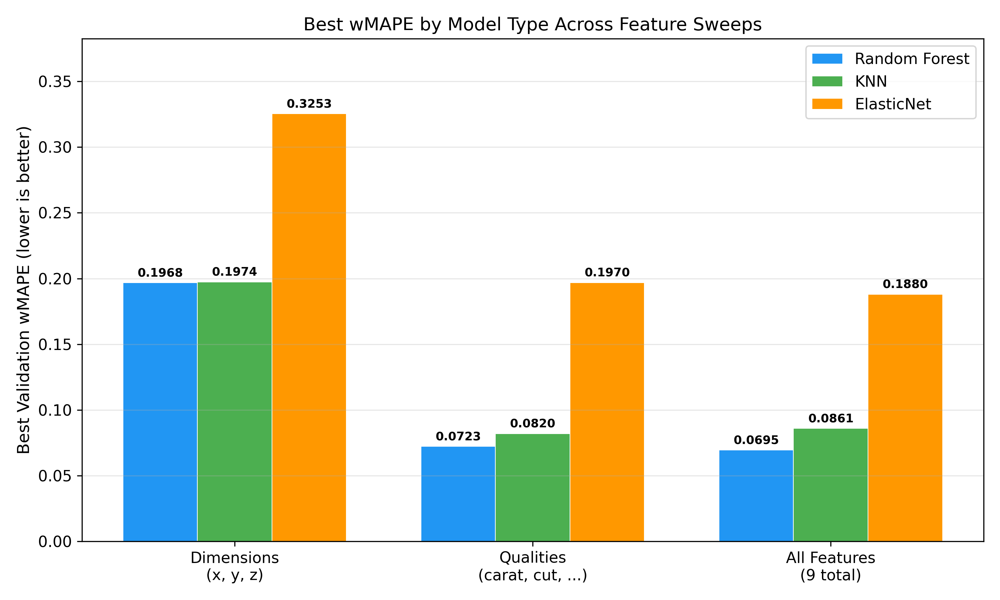
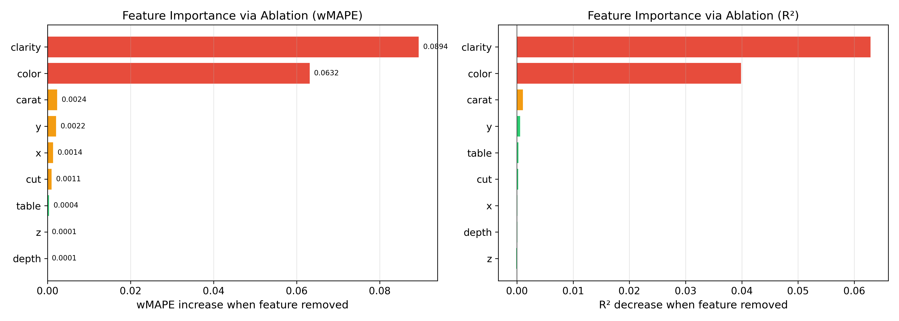
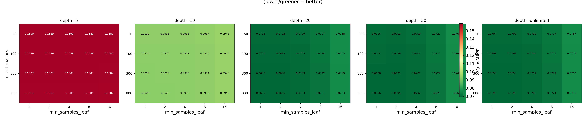

# Diamond Regression

Complete project package for a diamond price regression study, including:

- source code for training/evaluation/sweeps
- precomputed sweep outputs and model artifacts
- publication-style LaTeX report and compiled PDF
- generated figures used in the report

Raw dataset files are intentionally excluded from this repository.

## Report

- PDF: [`report.pdf`](report.pdf)
- LaTeX source: [`report.tex`](report.tex)

## Included Visuals

The repository already contains generated figures under `plots/` and `plot_local/`.







## Quick Start

```bash
python -m venv .venv
source .venv/bin/activate
pip install -r requirements.txt
```

## Reproduce Figures

### Full report plots (existing project scripts)

```bash
python generate_plots.py
python generate_param_plots.py
python gen_again.py
```

### Lightweight summary plots (single script)

```bash
python visualize_summary.py
```

This script generates:

- `plots/summary_cross_sweep_wmape.png`
- `plots/summary_rf_feature_importance.png`

## Project Layout

- `big_sweep/`: precomputed sweep runs (`dimensions`, `qualities`, `all_features`, `local`)
- `plots/`: report figures
- `plot_local/`: local exploratory run figures
- `regress_train.py`: train one or more models
- `rf_param_train.py`: run large parameter/feature sweeps
- `eval_examine.py`: inspect trained models
- `gather_sweep_local_insights.py`: generate local sweep appendix material
- `report.tex` / `report_generated.tex`: paper source

## Notes

- To rerun training/sweeps, provide your own diamonds CSV path.
- The sweep outputs in `big_sweep/` are sufficient to regenerate all visuals and the report without raw data.

